# Agentgateway Chrome extension

A Chrome extension for chatting, testing, and teaching [Solo Agentgateway](https://docs.solo.io/agentgateway/latest/) (LLM, MCP, A2A, and API/HTTP) against **your** Kubernetes cluster. Point it at a reachable API server, apply Gateway / Agentgateway CRDs from the popup, and run the same hops you would show in a live demo.

The extension is in [`chrome-extension/`](chrome-extension/). Current version: **0.18.0** (`manifest.json`).

## Use cases

These match the tabs and header controls in the popup.

- **Chat with an LLM through Agentgateway.** On **Chat**, set **Endpoint URL**, pick a **Provider** (OpenAI, Claude, Grok, Bedrock, Gemini, DGX), choose a **Model**, then send a message. Check **Stream** to send `stream: true` and render SSE tokens. The hop flow shows AI Agent → Agentgateway → provider. The gateway injects backend auth — Chat does not store or send an API key. To fire a one-shot test instead of a conversation, use **LLM → Tests → Chat ping**.


- **LLM provider testing.** The **LLM** tab has **Tests**, **Workshop**, and **Build**. **Tests** runs **Chat ping** and **Model failover** (plus **List / call model** further down) against the Chat endpoint. Each card has a visual hop flow (AI Agent → Agentgateway → provider), a result drawer with latency, an estimated token/cost line when usage is present, and **Open in Solo UI**.

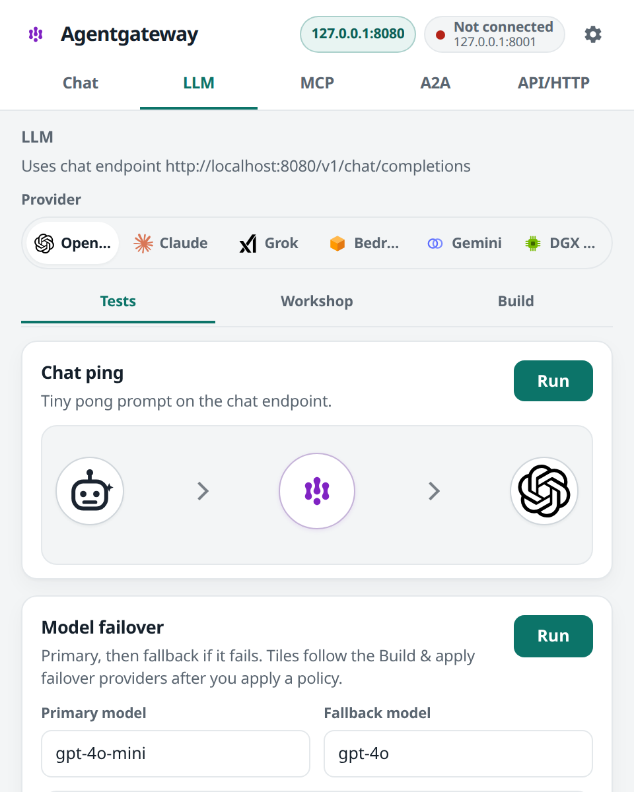

- **Deploy and test LLM configs from a catalog.** On **LLM → Build**, search the **LLM config catalog** (Connect / Route / Protect / Control), fill the form, preview YAML, and **Apply** `Gateway`, `HTTPRoute`, `EnterpriseAgentgatewayBackend`, and `EnterpriseAgentgatewayPolicy` (plus Model / RateLimit / Budget where the recipe uses them).
- **MCP: one-click virtual MCP, live status, and tests.** The **MCP** tab has **Tests**, **Deploys**, **Workshop**, and **Build**. **Tests** probes **MCP initialize** and **List tools** (plus echo, fetch, JWT, and tool-calling cards further down). **Deploys** has one-click examples (for example **Deploy everything server**, **Deploy website fetcher**, **Deploy virtual MCP**) with a live **Running** / **Pending** / **Error** (or **Missing**) chip, then **Run test** / **Run all**.

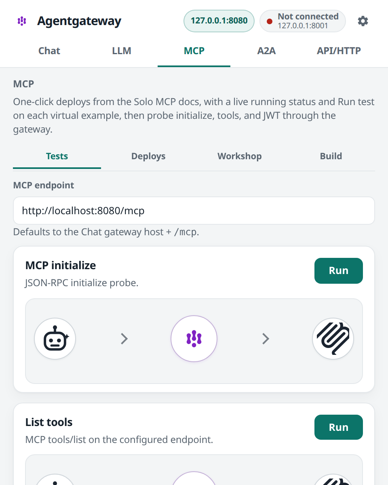

- **A2A and API/HTTP.** **A2A** and **API/HTTP** each have **Tests**, **Workshop**, and **Build**. **A2A → Tests** probes **A2A agent-card / health**. **API/HTTP → Tests** runs generic HTTP and policy connectivity checks. Each tab can **Apply** a prebuilt example when a cluster is connected.
- **Connect to any cluster and apply CRDs.** **Settings** has its own sub-tabs — **Connect**, **Forward**, **Resources**, **Identity**, **App**. On **Connect**, pick how you reach the cluster (**kubectl proxy**, **API + token**, or **Omni**) and follow the numbered steps; each ticks as you satisfy it. Then apply from the builders or **Resources**.
- **Corporate IdP JWT on a dedicated LLM route.** In **Settings → Identity**, paste Entra tenant / client / token or Keycloak issuer / realm / audience. **Apply Entra JWT** or **Apply Keycloak JWT** puts Strict JWT on `/openai-entra` or `/openai-keycloak` so Chat on `/openai` stays open. Mint an Entra token with `az account get-access-token` (v1) or `az account get-access-token --resource api://<client-id>`.
- **Clusters without a public proxy.** **Settings → Forward** copies a `kubectl port-forward` command. Run it locally, click **Use localhost**, and point Chat / MCP / API tests at `127.0.0.1`. **Check localhost** reports Reachable or Not reachable.
- **Persistence.** The last top-level tab is remembered. A **Connected** / **Not connected** chip (or **Checking** on open) sits in the header; click it to jump to **Settings → Connect**.

## Workshop demos

Each of **LLM**, **MCP**, **A2A**, and **API/HTTP** has **Apply** + **Run** cards from the Solo Enterprise Agentgateway workshop (plus a few original flows). Hop labels include promptGuard, prompt.prepend, rateLimit, OpenAPI→REST, WAF, and A2A task. Dedicated paths (`/openai-jwt`, `/openai-entra`, `/openai-keycloak`, `/mcp-weather`, `/mcp-jwt`) keep default Chat / MCP usable.

**LLM**

- **Prompt Guard pass vs jailbreak** — builtin guardrails: pass, DAN jailbreak → 403, fake SSN/email → 422, invented email masked as `<EMAIL_ADDRESS>`
- **Prompt enrichment** — prepend a system “Return the response in JSON format”
- **Local token budget → 429** — 5 input tokens / minute on HTTPRoute `openai`; burst tiny chat pings: 200 then 429
- **Stream ping** — no extra CRD; sends `stream: true` and renders SSE `delta.content` (shows TTFT)
- **Embeddings ping** — `POST /v1/embeddings` on the Chat host
- **Body-based routing** — PreRouting sets `x-gateway-model-name` from `json(request.body).model`
- **Mock OpenAI** — deploy `llm-d-inference-sim` + `/openai` when you have no provider key
- **Timeouts / retries** — timeout + retry on mock-openai (200, or 504 if the mock is down)

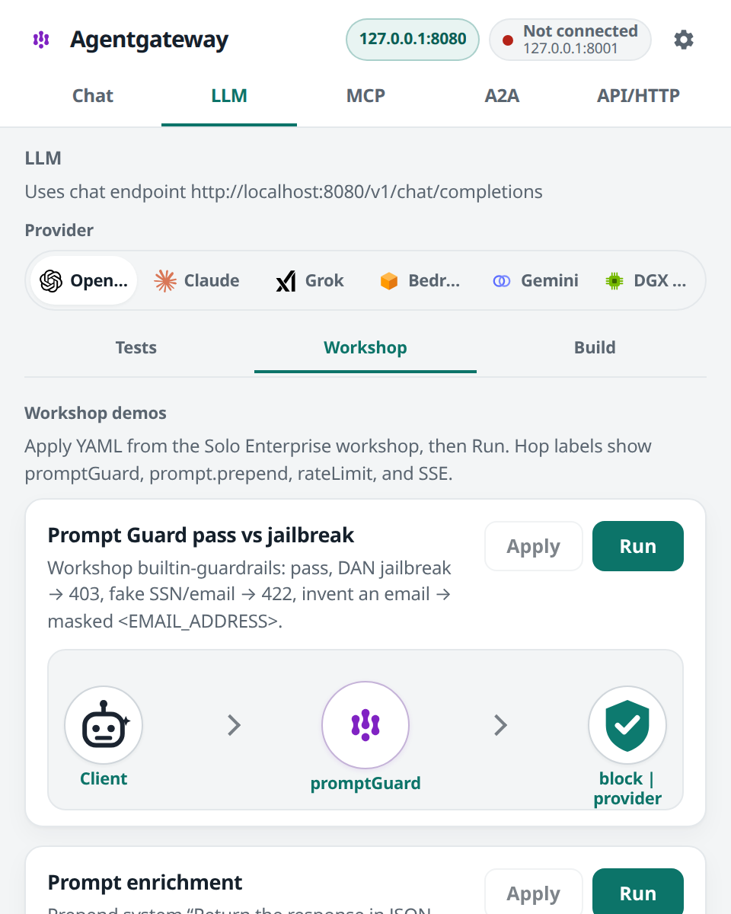

**MCP**

- **OpenAPI → MCP (Open-Meteo)** — ConfigMap schema + entMcp OpenAPI to `api.open-meteo.com`; initialize → list → `getWeatherForecast` (London)
- **Remote MCP (search.solo.io)** — TLS backend; initialize + list tools
- **MCP tool rate limit** — hammer one tool until 429; echo still 200
- **Tool federation FailOpen** — slim virtual MCP with two targets
- **Composable MCP** — `entMcp.targets[].custom` HTTP echo
- **Tool mode Search / Code** — `get_tool` + `invoke_tool`, or `run_code`
- **MCP JWT + tool RBAC** — Strict JWT on `/mcp-jwt` and CEL `mcp.tool.name==echo`


**A2A**

- **A2A agent-card / health** — GET agent-card, or POST health
- **Real A2A task** — GET agent-card, POST `tasks/send`, poll `tasks/get` until completed or timeout (`gcr.io/solo-public/docs/test-a2a-agent`)

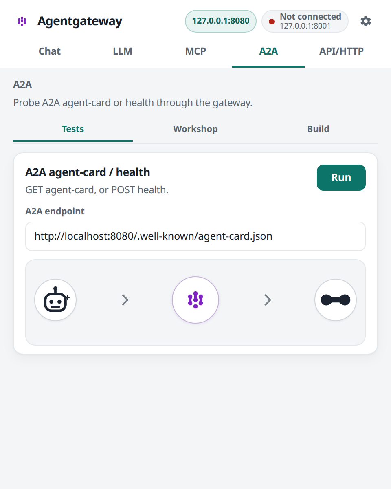

**API/HTTP**

- **WAF first-pass** — WAFPolicy model allow-list + `rm -rf` signature on `/openai-waf`; allowed 200, disallowed model or `rm -rf` → 403
- **Direct response / health** — HTTPRoute `/health` returns a fixed body (no backend)
- **JWT + RBAC on LLM** — Strict JWT + CEL on `/openai-jwt` so Chat without a token still works
- **Entra JWT on LLM** — Strict JWT on `/openai-entra` from **Settings → Identity** (tenant, client, v1/v2 issuer, optional token)
- **Keycloak JWT on LLM** — Strict JWT on `/openai-keycloak` from **Settings → Identity** (issuer, realm, audience, optional token)

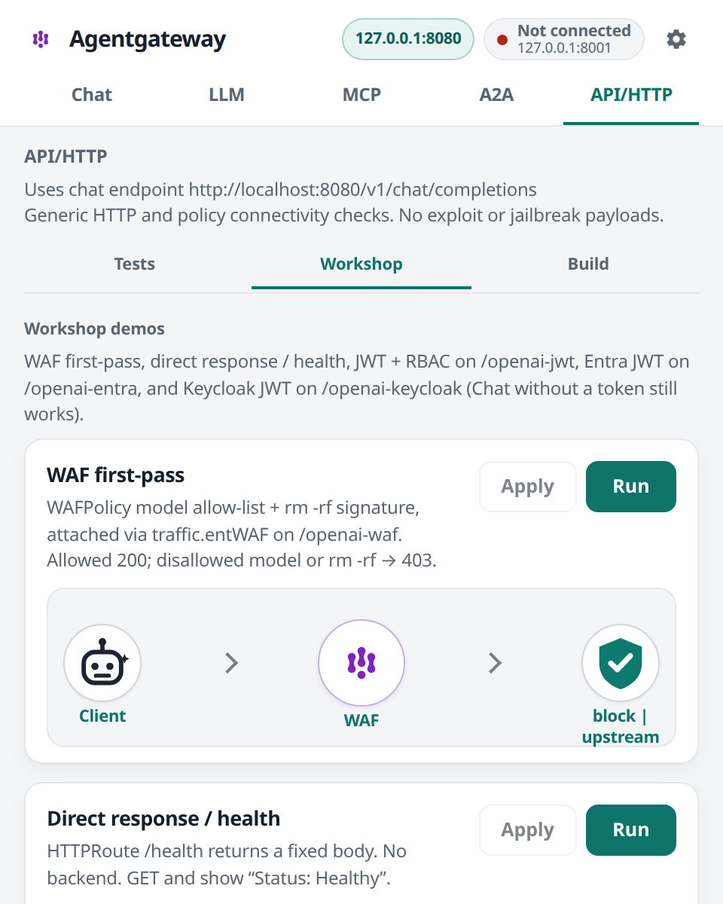

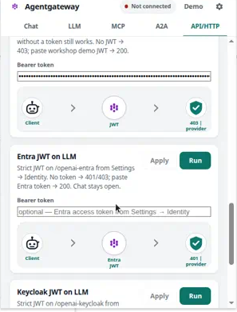

## Install

Not on the Chrome Web Store. Load it unpacked in Chrome (desktop).

### Download

The Load unpacked package (extension files only — not the whole repo):

- [`packages/agentgateway.zip`](packages/agentgateway.zip)
- Direct: [agentgateway.zip](https://github.com/sebbycorp/agw-extension/raw/main/packages/agentgateway.zip)

1. Download [agentgateway.zip](packages/agentgateway.zip)
2. Unzip → `chrome-extension/` with `manifest.json`
3. Chrome `chrome://extensions` → Developer mode → Load unpacked → select that `chrome-extension` folder

If you want the full source (infra, tests, docs):

- Whole-repo zip: [agw-extension-main.zip](https://github.com/sebbycorp/agw-extension/archive/refs/heads/main.zip)
- Or on the GitHub repo page: green **Code** → **Download ZIP**
- Or `git clone https://github.com/sebbycorp/agw-extension.git` then use `agw-extension/chrome-extension/`

### Load in Chrome

1. Open `chrome://extensions`.
2. Turn on **Developer mode** (top right).
3. Click **Load unpacked**.
4. Select the **`chrome-extension`** folder — the one that contains `manifest.json`.
5. Pin **Agentgateway** from the extensions menu so the toolbar icon stays visible.

Click the toolbar icon to open the popup. Version **0.18.0** is the `version` field in `chrome-extension/manifest.json`. If you already had an older build loaded, click **Reload** on the unpacked card so you pick up the new **Settings** sub-tabs.

## Configure it to your cluster

Open the **gear** in the header. That is **Settings**, with sub-tabs **Connect**, **Forward**, **Resources**, **Identity**, and **App**. Cluster connection lives on **Connect**, not on a top-level tab.

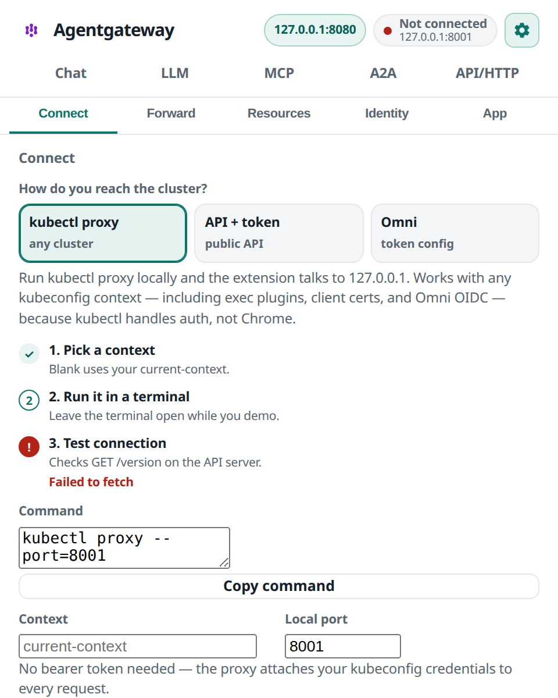

### Connect with kubectl proxy (recommended, any cluster)

This is the simplest path and the only one that works for every cluster type, because `kubectl` — not Chrome — handles authentication. Exec plugins, client certificates, and OIDC all work.

1. Open **Settings → Connect** and pick the **kubectl proxy** card.
2. Optionally set **Context** (blank uses your `current-context`) and **Local port** (default `8001`).
3. Click **Copy command** and run it in a terminal, leaving it open:

   ```bash
   kubectl proxy --port=8001 --context=my-cluster
   ```

4. Click **Test connection**. No bearer token is needed — the proxy attaches your kubeconfig credentials to every request.

This solves the two problems that block the other sources: Chrome rejects self-signed API server CAs (kind, k3d, minikube), and Chrome cannot run exec plugins (`gke-gcloud-auth-plugin`, `kubelogin`, `aws eks get-token`, Omni `oidc-login`). The proxy listens on `127.0.0.1`, which Chrome trusts, and runs those plugins locally.

The terminal must stay open, and the proxy runs on the same machine as Chrome.

### Connect with API server URL + bearer token

1. Open **Settings → Connect** and pick the **API + token** card.
2. Choose **Cluster type** (GKE, AKS, EKS, or Local). The hint under the dropdown tells you where to get the server and token for that type.
3. Paste **API server URL** (for example from `kubectl cluster-info`).
4. Paste **Bearer token** (password field). Chrome cannot run exec plugins, so this must be a real token — not a kubeconfig that only has `exec`.
5. Set **Namespace** (default `agentgateway-system`).
6. Click **Test connection**.


Typical token sources (same text the UI uses):

| Cluster type | API server | Token |
| --- | --- | --- |
| GKE | `kubectl cluster-info` or `gcloud container clusters describe` | `gcloud auth print-access-token` |
| AKS | `az aks show` | A service-account token, or `az` / `kubelogin` output — not the exec kubeconfig alone |
| EKS | `aws eks describe-cluster` | `aws eks get-token --cluster-name …` |
| Local | Your API server URL | For example `kubectl create token` |

### Paste a kubeconfig (token-based)

Under **Kubeconfig YAML (optional)**, paste a kubeconfig that includes `user.token` (or an `auth-provider` token). Click **Parse kubeconfig**. If there are multiple contexts, pick one from **Context / cluster**. That fills **API server URL** and **Bearer token**.

Chrome cannot run exec plugins (`gke-gcloud-auth-plugin`, `kubelogin`, `aws eks get-token` as an exec plugin, Omni `oidc-login`). An exec-only kubeconfig will not work. Client-certificate kubeconfigs are also unsupported.

### Omni (Sidero Omni)

**The easiest way to reach an Omni cluster is [kubectl proxy](#connect-with-kubectl-proxy-recommended-any-cluster)** with your normal OIDC kubeconfig — no `omnictl`, no service-account token, nothing to expire. Use the token-kubeconfig flow below only if you need a connection that survives without a terminal open.

Omni’s management API is gRPC, so the extension cannot list clusters from the browser. Connect with a **token** kubeconfig.

1. In a terminal (not Chrome), generate a service-account kubeconfig:

   ```bash
   omnictl kubeconfig --service-account --cluster <name> --user <username> ./omni.kubeconfig
   ```

2. In **Settings → Connect**, pick the **Omni** card.
3. Confirm **Omni URL** (default `https://maniak.na-west-1.omni.siderolabs.io`).
4. Optionally paste **OMNI_SERVICE_ACCOUNT_KEY**. That key is stored locally; it is not used to list clusters.
5. Paste the kubeconfig into **Omni kubeconfig**. If there are multiple contexts, pick **Context / cluster**.
6. **Parse kubeconfig**, then **Test connection**.

The kubeconfig from the Omni UI (**Download kubeconfig**) or `omnictl kubeconfig` without `--service-account` is exec-based. Chrome cannot run `omnictl` or that plugin. The popup will say you need a token kubeconfig.

### How to tell it worked

The header chip next to the gear shows **Connected** (plus a short host or context hint) or **Not connected**. On open it may briefly show **Checking**. Click the chip to return to **Settings → Connect**.

### Port forward (no public proxy)

If the cluster does not expose Agentgateway on a public load balancer:

1. Stay in **Settings → Forward**.
2. Confirm **Resource** (Service or Deployment), **Name** (default `agentgateway-proxy`), **Namespace** (default `agentgateway-system`), **Local port** (`8080`), and **Remote port** (`80`).
3. Click **Copy command**. Example:

   ```bash
   kubectl -n agentgateway-system port-forward svc/agentgateway-proxy 8080:80
   ```

4. Run that command on the same machine where Chrome is open. The extension cannot start the tunnel.
5. Click **Use localhost** so Chat and API/HTTP tests use `http://127.0.0.1:<localPort>` (Chat still appends `/v1/chat/completions`). Turn on **MCP path** if MCP should use `http://127.0.0.1:<port>/mcp`.
6. Click **Check localhost**. You want **Reachable**. A `127.0.0.1:<port>` chip appears in the header while tests use localhost.

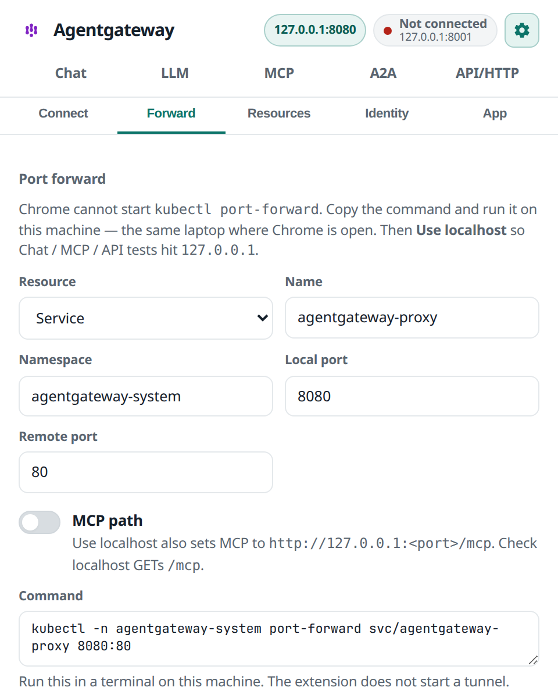

For Omni, port-forward still needs a working kubeconfig on that laptop (`omnictl kubeconfig` / OIDC). It is local kubectl, not the extension token.

### Chat endpoint

On **Chat**, set **Endpoint URL** to your Agentgateway chat completions URL — a public load balancer, or `http://127.0.0.1:<port>/v1/chat/completions` after port-forward. If you enter a base URL without `/v1/chat/completions`, the extension appends that path.

MCP defaults to the Chat gateway host + `/mcp` unless you override **MCP endpoint**.

### Solo UI (optional)

In **Settings → App**, set **Solo UI URL** to the Solo UI app base (path `/age/`). After a **Test** or **Run**, **Open in Solo UI** opens the traces page (`/age/tracing`, or `/age/tracing/<id>` when a trace id is in the response headers). **Hooray** plays a short confetti burst after a successful test.

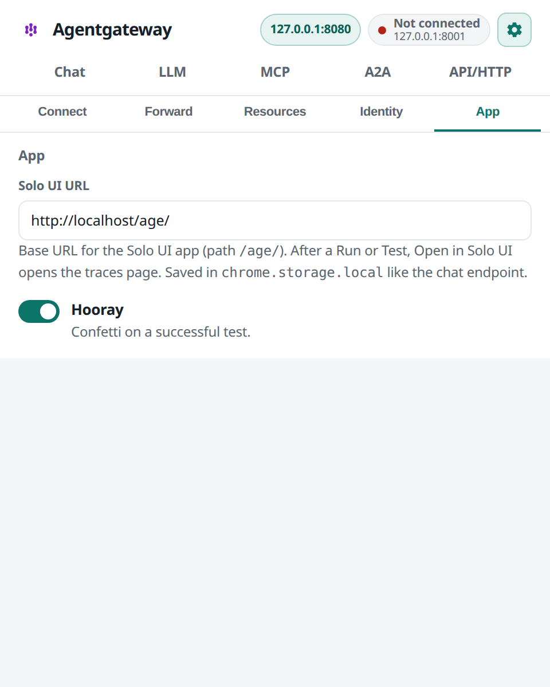

### Identity (Entra ID / Keycloak)

Under **Settings → Identity**, paste corporate IdP details. Fields persist in `chrome.storage.local` (tokens are password fields and are not logged).

**Entra ID** — Tenant ID (required to Apply), optional Client ID / audience, issuer **v1** (`https://sts.windows.net/<tenant>/`) or **v2**, optional access token. **Apply Entra JWT** targets HTTPRoute `/openai-entra`. Mint a token with:

```bash
az account get-access-token
# or, to match a client audience
az account get-access-token --resource api://<client-id>
```

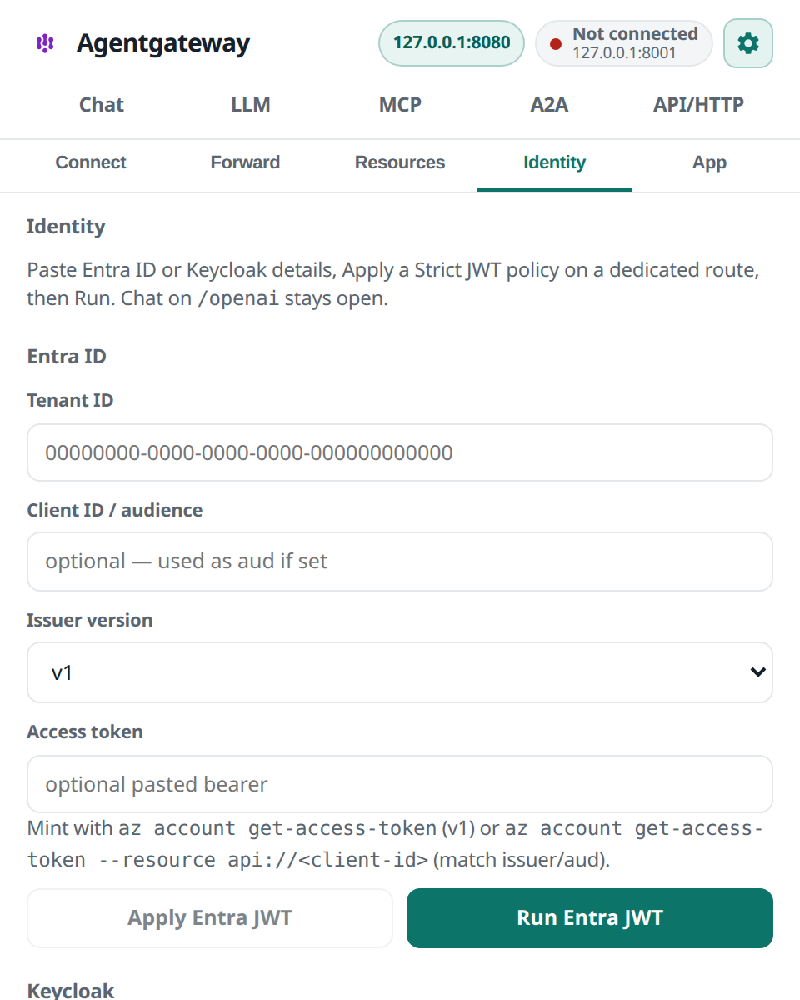

**Keycloak** — Issuer URL with no trailing slash (for example `http://10.0.0.5:8080/realms/mcp-enterprise`), optional realm (parsed from `/realms/<name>` if empty), optional audience, optional access token. **Apply Keycloak JWT** targets `/openai-keycloak`.

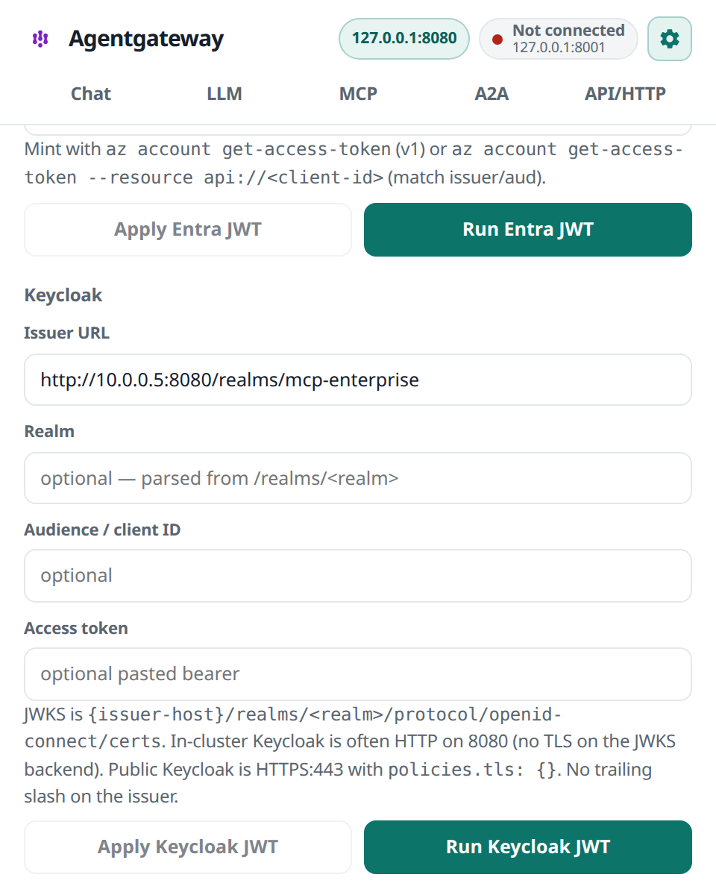

**Run** posts chat completions with no token (expect 401/403), then with the pasted bearer if present (expect 200). The result shows `iss` / `aud` (and Entra `tid`) from the JWT payload — never the raw token.

## Quick start after connect

- Confirm the header chip says **Connected**.
- Open **Chat**, set **Endpoint URL** (or **Use localhost**), pick a provider and model, and send a message.
- Open **LLM → Tests**, run **Chat ping**, then open **LLM → Build** and **Apply** a catalog item (Connect / Route / Protect / Control).
- Open **MCP → Deploys**, click a one-click deploy (for example **Deploy virtual MCP**), wait for **Running**, then **Run test** or **Run all**.
- Optionally set **Solo UI URL** in **Settings → App** and use **Open in Solo UI** on a result drawer.

## Requirements / limits

- **Chrome on desktop only.** This is a Manifest V3 unpacked extension. It does not run on Android or in other browsers.
- You need a **reachable Kubernetes API** (or you paste API server + bearer token that the browser can `fetch`). Chrome rejects untrusted / self-signed API server CAs (common with kind / minikube / k3d) unless the CA is trusted by the OS.
- Use a **token kubeconfig** or a pasted bearer token. `gcloud` / `az` / AWS / Omni **exec** plugins do not run inside Chrome.
- The extension **cannot spawn kubectl**. That is why **Port forward** is copy/paste, then **Use localhost** / **Check localhost**.
- Chat and the test tabs do **not** store provider API keys or a Solo license. Cluster tokens stay in `chrome.storage.local` (not sync) and are not logged.

Endpoints default to `http://localhost:8080`, which matches the port-forward command in **Settings → Forward**. Run that command and the defaults work as-is; otherwise point **Endpoint URL** and **Solo UI URL** at your own gateway.

Terraform under `infrastructure/` is still in the repo if you want to stand up a demo cluster later.
