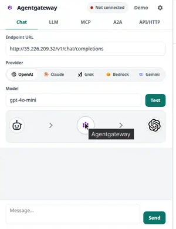

# Agentgateway (Chrome extension)

Install, cluster setup, workshop demo cards, and how to use the popup are in the [root README](../README.md). Workshop screenshots (LLM token budget / streaming / embeddings, OpenAPI→MCP, Real A2A task, WAF) live in that [Workshop demos](../README.md#workshop-demos) section.

## Load unpacked

Prefer [`packages/agentgateway.zip`](../packages/agentgateway.zip) (or [direct download](https://github.com/sebbycorp/agw-extension/raw/main/packages/agentgateway.zip)) — unzip, then load the `chrome-extension/` folder that contains `manifest.json`. The whole-repo zip / `git clone` still works if you want source.

1. Open `chrome://extensions`.
2. Turn on **Developer mode** (top right).
3. Click **Load unpacked**.
4. Select **this folder** (`chrome-extension/`) — the one that contains `manifest.json`, not the repo root.

Current version: **0.11.0** (`manifest.json`). Pin the toolbar icon, then open the gear for **Settings → Cluster** and **Settings → Identity**. If you already had 0.10.1 loaded, click **Reload** on this unpacked card.

**Identity** — paste Entra tenant / client / token or Keycloak issuer / realm / audience. **Apply Entra JWT** or **Apply Keycloak JWT** puts Strict JWT on `/openai-entra` or `/openai-keycloak` (Chat on `/openai` stays open). Mint an Entra token with `az account get-access-token` (v1) or `az account get-access-token --resource api://<client-id>`. Settings → Identity and the API/HTTP Entra / Keycloak cards are in the [root README](../README.md#identity-entra-id--keycloak) shots.
